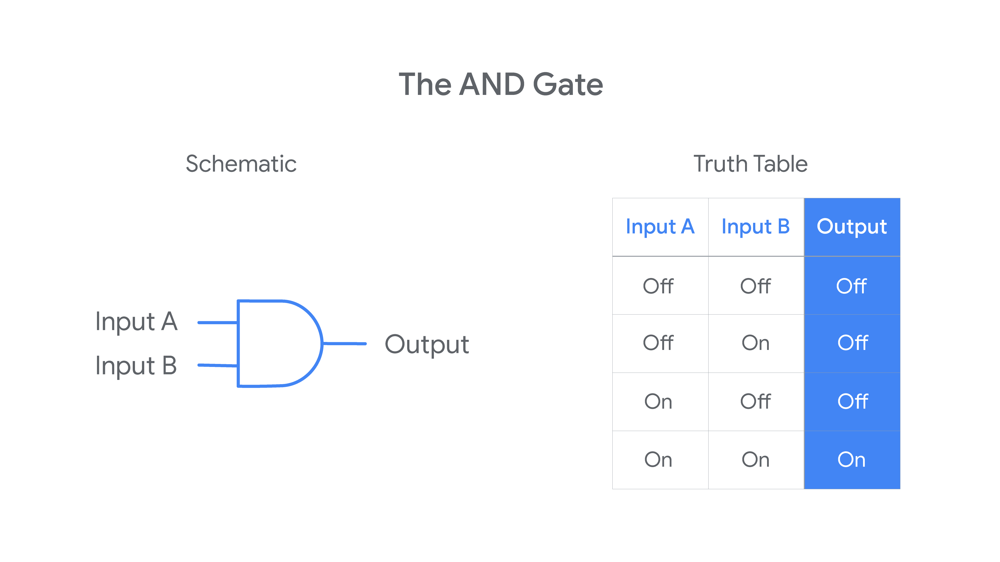
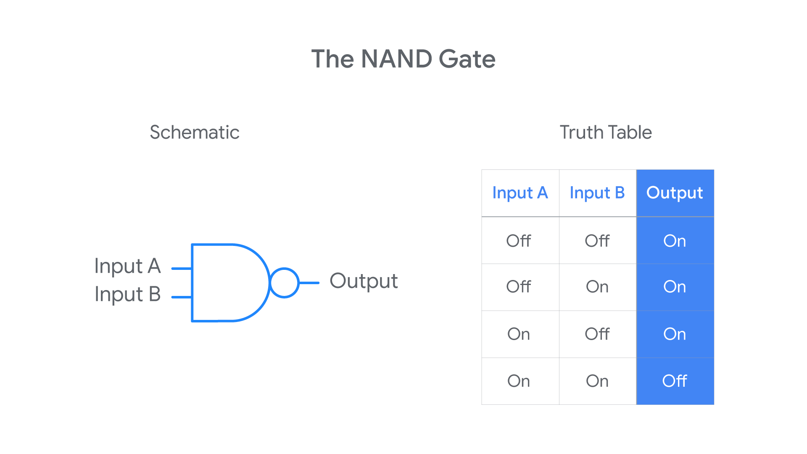

# Course 1: Technical Support Fundamentals

* Information Technology(IT): The use of digital technology, like computers and the internet, to store and process data into useful information.

* Use of IT
    * Education
    * Medicine
    * Journalism
    * Construction
    * Transportation
    * Entertainment 
    * Any Industry

* It personal responsibilities
    * Managing
    * Installing 
    * Maintaining
    * Troubleshooting
    * Configuring

* Computer: A device that stores and processes data by performing calculations.

* Algorithm: A series of steps that solve specific problems.

* Cryptography: The art of writing and solving codes.

* Entertainment computers like the Pong machine launched the video game era.

* Open Source: Anyone could modify and share it.

* Linux: A widely used open source operating system.

* Binary System: The Communication that a computer uses, also known as a base-2 numeral system.

* we group binary into 8 numbers or bits.
* Technically, a bit is a binary digit. 
* A group of 8 bits is referred as a byte.

* Each byte can store 1 character, and we can have 256 possible values thanks to the base-2 system(2^8)
    
    * 01001000 -  H
    * 01100101 - e
    * 01101100 - I
    * 01101111 - o

* Character encoding: Assigns our binary values to characters, so that we as humans can read them.

* ASCII: Represent the English alphabets, digits and punctuation marks.

* The first character in the ASCII to binary table -- "a lowercase a" -- map to 01100001 in binary.

* UTF-8 : Unicode Standard

* Logic Gates: Allow our transistors to do more complex tasks, like decide where to send electrical signals depending on logical conditions.

## Six common logic gates

1. NOT Gate

The NOT gate is the simplest because it has only one input signal. The NOT gate takes that input signal and outputs a signal with the opposite binary state. If the input signal is “on,” a NOT gate outputs an “off” signal. If the input signal is “off,” a NOT gate outputs an “on” signal

2. AND Gate

The AND gate involves two input signals rather than just one. Having two input signals means there will be four possible combinations of input values. The AND rule outputs an “on” signal only when both the inputs are “on.” Otherwise, the output signal will be “off.”

3. OR Gate

The OR gate involves two input signals. The OR rule outputs an “off” signal only when both the inputs are “off.” Otherwise, the output signal will be “on.”

4. XOR Gate

The XOR gate also involves two input signals. The XOR rule outputs an “on” signal when only one (but not both) of the inputs are “on.” Otherwise, the output signal will be “off.”

5. NAND Gate

The NAND gate involves two input signals. The NAND rule outputs an “off” signal only when both the inputs are “on.” Otherwise, the output signal will be “on.”

If you compare the truth tables for the NAND and AND gates, you may notice that the NAND outputs are the opposite of the AND outputs. This is because the NAND rule is just a combination of the AND and NOT rules: it takes the AND output and runs it through the NOT rule! For this reason, you might hear the NAND referred to as a “not-AND” gate.

6. XNOR Gate

Finally, consider the XNOR gate. It also involves two input signals. The XNOR rule outputs an “on” signal only when both the inputs are the same (both “On” or both “Off”). Otherwise, the output signal will be “off.”

The XNOR rule is another combination of two earlier rules: it takes the XOR output and runs it through the NOT rule. For this reason, you might hear the XNOR referred to as a “not-XOR” gate.

---------------------------------------------------------

## Binary Conversion

Decimal values, binary values, and characters are all used to communicate information. Computers receive and communicate information with binary values, so the binary system shapes the rules and conventions of how computers interact with one another.

### Use a table to convert between decimal and binary

By convention, decimal numbers are represented with 8 bits (1 byte) in binary. Each bit is either a 0 or a 1, so 28 = 256 decimal numbers can be represented with 1 byte. Additionally, each bit represents a specific decimal value based on its order in the byte. The 1st (leftmost) bit is 128, and each bit after that is half the value of the previous one. 

### Convert from binary to decimal values

To use the table to convert from binary to decimal values, enter the byte you want to convert into the “Off or on” row. For example, to convert the byte 10011101 to a decimal value, fill the “Off or on” row with the values of each bit in the byte, like this: 

|              | 1st bit | 2nd bit | 3rd bit | 4th bit | 5th bit | 6th bit | 7th bit | 8th bit |
|--------------|---------|---------|---------|---------|---------|---------|---------|---------|
|Decimal Value | 128     | 64      |  32     |  16     |   8     |    4    |    2    |   1     |
|Off or On     |   1     |   0     |   0     |   1     |   1     |    1    |    0    |   1     |

In this example, 128 + 16 + 8 + 4 + 1 = 157. Therefore, the decimal value represented by the binary number 10011101 is 157.

### Convert from decimal to binary values

To use this table to convert from a decimal value to a binary value, put 0s and 1s in the “Off or on” row of the table so that the sum of the decimal values of any columns that contain a 1 in the “Off or on” row  add up to the decimal value. For example, to convert the decimal value 87 to binary, you’d fill out the table like this: 

|              | 1st bit | 2nd bit | 3rd bit | 4th bit | 5th bit | 6th bit | 7th bit | 8th bit |
|--------------|---------|---------|---------|---------|---------|---------|---------|---------|
|Decimal Value | 128     | 64      |  32     |  16     |   8     |    4    |    2    |   1     |
|Off or On     |   0     |   1     |   0     |   1     |   0     |    1    |    1    |   1     |

The sum of 64 + 16 + 4 + 2 + 1 is 87, so the binary value that represents 87 is 01010111.

### Character encoding: From binary values to characters

As you learned earlier in this lesson, character encoding assigns binary values to characters so that humans can read them. The American Standard Code for Information Interchange (ASCII) was the first character encoding standard used. It uses one byte to represent each character in the English alphabet, digits, and punctuation. Each byte maps to a specific character, so ASCII can only represent 256 characters. The following table displays the ASCII table for the first 5 lowercase letters in the English alphabet: 

| Binary Value   | Decimal Value | Character | 
|----------------|---------------|-----------|
|  01100001      | 97            | a         |  
|  01100010      | 98            | b         |  
|  01100011      | 99            | c         |  
|  01100100      | 100           | d         |  
|  01100101      | 101           | e         |  

UTF-8 is a newer standard that uses the same ASCII character encodings but allows characters to be represented with more than one byte. This allows many more characters–and even emojis–to be represented with binary. 

## Computer Architecture Layer

* Abstraction: To take a relatively complex system and simplify it for our use.

### Four Layer of Computer

Hardware   <-->  Operating System <--> Software  <-->  User

* Hardware Layer: Made up of the physical components of a computer.
* Operating System: Allows hardware to communicate with the System.
* Software Layer: How we as humans interact with out computer.
* User: Interacts with the computer.

### Summary

* Abstraction: To take a relatively complex system and simplify it for our use

* Algorithm: A series of steps that solves specific problems

* ASCII: The oldest character encoding standard used is ASCII. It represents the English alphabet, digits, and punctuation marks

Binary system: The communication that a computer uses is referred to as binary system, also known as base-2 numeral system

Byte: A group of 8 bits

Character encoding: Is used to assign our binary values to characters so that we as humans can read them

Computer: A device that stores and processes data by performing calculations

Cryptography: The overarching discipline that covers the practice of coding and hiding messages from third parties

Decimal form- base 10 system: In the decimal system, there are 10 possible numbers you can use ranging from zero to nine

Digital divide: The growing skills gap between people with and without digital literacy skills

Information technology: The use of digital technology, like computers and the internet, to store and process data into useful information

Linux OS: Linux is one of the largest open source operating systems used heavily in business infrastructure and in the consumer space

Logic gates: Allow transistors to do more complex tasks, like decide where to send electrical signals depending on logical conditions

Open source: This means the developers will let other developers share, modify, and distribute their software for free

PDA (Personal Digital Assistant): Allows computing to go mobile

Punch cards: A sequence of cards with holes in them to automatically perform calculations instead of manually entering them by hand

RGB model: RGB or red, green, and blue model is the basic model of representing colors

UTF-8: The most prevalent encoding standard used today

## The Modern Computer

* Ports: Connection points that we connect devices to that extend the functionality of out computer.

* CPU (Central Processing Unit): THe brain of our computer, it does all calculation and data processing.

* Hard drive: Holds all of our data, which includes all of our music, pictures, applications.

* Motherboard: The body or circulatory system of the computer that connects all the pieces together.

* Programs: Instructions that tells the computer what to do.

* External Data bus(EDB): A row of wires that interconnect the parts of our computer.

* Memory Controller Chip: A memory controller chip is a digital circuit that manages the flow of data to and from a computer's main memory (RAM)

* It acts as an intermediary between the CPU and memory, handling read and write operations, refreshing memory, and ensuring data integrity. Older systems often had the memory controller on a separate northbridge chip, but modern systems integrate it directly into the CPU (Integrated Memory Controller or IMC)

* Cache memory is a type of high-speed memory that stores frequently accessed data and instructions, allowing the CPU to retrieve information much faster than accessing main memory (RAM).
 
    
* A "clock wire" in a computer's CPU refers to a wire that carries a clock signal, a periodic pulse that synchronizes the actions of different components within the CPU. This signal dictates when components should update their state, ensuring they operate in unison and that data is processed correctly. Without this clock signal, the CPU's components would not be able to coordinate and would not be able to function.

* Clock spped: The maximum number of clock cycles that it can handle in a cerain period of time.

* For examples: A 3.40 gigahertz is 3.4 billion cycles per second.

* CPU cache: CPUs use a system of cache storage to help them quickly access data. A CPU cache is normally stored inside each core of the CPU. Older computers might store CPU cache in a transistor chip that is attached to the motherboard, along with a high-speed bus connecting the chip to the CPU. 

#### CPU levels of cache

There are three levels of CPU cache memory:

* Level 3 cache: L3 cache is the largest and slowest of CPU cache. However, it is often twice as fast as RAM. L3 is the first CPU cache location to store data after it is transferred from RAM. L3 cache is often shared by all of the cores in a single CPU. 

* Level 2 cache: L2 cache holds less data than L3 cache, but it has faster access speeds. L2 holds a copy of the most recently accessed data that is not currently in use by the CPU. Each CPU core normally has its own L2 cache.

* Level 1 cache: L1 cache is the fastest and smallest of the three CPU cache levels. L1 holds the data currently in use by the CPU. Each CPU core usually has its own L1 cache.

#### Overclocking a cpu

* Overclocking a CPU sets it to run at a higher CPU clock frequency rate than the manufacturer’s original specifications. For example, if a processor is labeled as having a 3.2 GHz base frequency rate, it may be possible to overclock the CPU to run at 3.5 GHz. Achieving a higher CPU clock frequency rate means the CPU can process a higher volume of instructions per nanosecond, resulting in faster performance. A computer user might want to overclock their CPU to improve sluggish speeds when performing processor-intensive tasks, like video editing or gaming. 

Overclocking a CPU’s frequency involves three variables:

* The base CPU clock frequency, often measured in GHz.
* The core frequency, which is calculated by multiplying the base frequency by the CPU core multipliers. 
* The core voltageF, which needs to be increased in small increments to meet the increasing power demand of the CPU during the overclocking process.

#### Warnings on overclocking

* Overclocking the CPU can damage the computer if not configured properly. Operating a CPU at a higher speed can overheat the CPU and surrounding hardware, which can cause the computer system to fail. Additionally, overclocking the CPU can shorten the overall lifespan of the computer and void the computer’s warranty. It is better to avoid overclocking the CPU and instead purchase the appropriate CPU speed necessary to meet computing demands.  

#### How to overclock a CPU safely

As an IT Support professional, you may be asked to overclock a CPU. There are steps you should follow to do this as safely as possible. Always make sure that the requestor understands the risks of overclocking before agreeing to perform this procedure. 

1. Check if overclocking is supported: First, make sure the CPU is a model that is unlocked for overclocking. Not all CPUs can support overclocking, including most laptop CPUs. Check the CPU manufacturer’s documentation to determine if overclocking is possible for the CPU model. Both Intel and AMD provide overclocking guides and tools for supported CPU models (see below for links to these guides). Additionally, check the documentation for the computer’s motherboard model to ensure that it can support an overclocked CPU.

2. Clean the inside of the computer: Turn off and unplug the computer. While wearing an anti-static wristband, open the computer and use compressed air to remove any dust build-up that has accumulated. It is especially important to remove any dust from around the CPU, fans, and intake vents.

3. Ensure an appropriate CPU cooler is installed (critical): If the computer has a stock CPU cooler, it is most likely insufficient for cooling an overclocked CPU. Replace the stock CPU cooler with an advanced cooling system, like a liquid cooling system.

4. Follow the manufacturer’s instructions for overclocking the CPU: Using the detailed instructions from the manufacturer (see below for links to Intel and AMD’s guides): 

    * Use benchmarking software to establish a baseline for the normal performance of the computer.
    * Set each CPU core multiplier to the value of the lowest multiplier using either the manufacturer’s overclocking software (recommended) or the BIOS. Then reboot the computer. 
    * Increase each CPU core multiplier by 1 to increase the CPU frequency. 
    * Test each increase for stability using the testing utility provided by the manufacturer. 
        * Fix any problems flagged by the testing tools, especially temperature alerts. If the system becomes too unstable, roll back to the last frequency that produced a stable performance and stop overclocking the CPU.
        * If the voltage appears to become insufficient to support the new frequency, increase the voltage by 0.05V. Do not increase the voltage above 1.4V without specialized cooling hardware.
        * If the computer freezes or crashes, it has either become completely unstable or the CPU is not getting enough voltage to support the overclocked frequency. Use the BIOS to return to the last stable frequency or increase the voltage in 0.01V increments until stable.

    * If stable, reboot the computer before attempting the next increase. 
 

## Components

