# Course 1: Technical Support Fundamentals

## Module 1: Introduction to IT

* Information Technology(IT): The use of digital technology, like computers and the internet, to store and process data into useful information.

* Use of IT
    * Education
    * Medicine
    * Journalism
    * Construction
    * Transportation
    * Entertainment 
    * Any Industry

* It personal responsibilities
    * Managing
    * Installing 
    * Maintaining
    * Troubleshooting
    * Configuring

* Computer: A device that stores and processes data by performing calculations.

* Algorithm: A series of steps that solve specific problems.

* Cryptography: The art of writing and solving codes.

* Entertainment computers like the Pong machine launched the video game era.

* Open Source: Anyone could modify and share it.

* Linux: A widely used open source operating system.

* Binary System: The Communication that a computer uses, also known as a base-2 numeral system.

* we group binary into 8 numbers or bits.
* Technically, a bit is a binary digit. 
* A group of 8 bits is referred as a byte.

* Each byte can store 1 character, and we can have 256 possible values thanks to the base-2 system(2^8)
    
    * 01001000 -  H
    * 01100101 - e
    * 01101100 - I
    * 01101111 - o

* Character encoding: Assigns our binary values to characters, so that we as humans can read them.

* ASCII: Represent the English alphabets, digits and punctuation marks.

* The first character in the ASCII to binary table -- "a lowercase a" -- map to 01100001 in binary.

* UTF-8 : Unicode Standard

* Logic Gates: Allow our transistors to do more complex tasks, like decide where to send electrical signals depending on logical conditions.

## Six common logic gates

1. NOT Gate

The NOT gate is the simplest because it has only one input signal. The NOT gate takes that input signal and outputs a signal with the opposite binary state. If the input signal is “on,” a NOT gate outputs an “off” signal. If the input signal is “off,” a NOT gate outputs an “on” signal

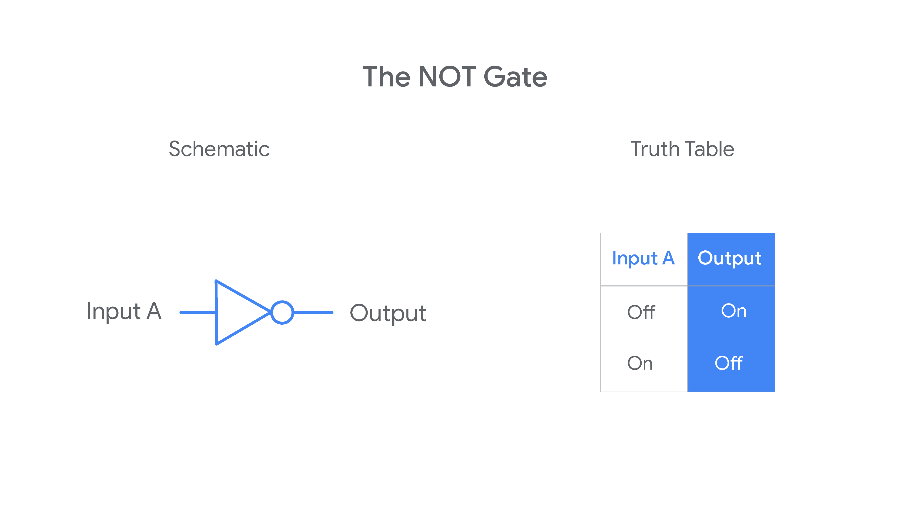

2. AND Gate

The AND gate involves two input signals rather than just one. Having two input signals means there will be four possible combinations of input values. The AND rule outputs an “on” signal only when both the inputs are “on.” Otherwise, the output signal will be “off.”

3. OR Gate

The OR gate involves two input signals. The OR rule outputs an “off” signal only when both the inputs are “off.” Otherwise, the output signal will be “on.”

4. XOR Gate

The XOR gate also involves two input signals. The XOR rule outputs an “on” signal when only one (but not both) of the inputs are “on.” Otherwise, the output signal will be “off.”

5. NAND Gate

The NAND gate involves two input signals. The NAND rule outputs an “off” signal only when both the inputs are “on.” Otherwise, the output signal will be “on.”

If you compare the truth tables for the NAND and AND gates, you may notice that the NAND outputs are the opposite of the AND outputs. This is because the NAND rule is just a combination of the AND and NOT rules: it takes the AND output and runs it through the NOT rule! For this reason, you might hear the NAND referred to as a “not-AND” gate.

6. XNOR Gate

Finally, consider the XNOR gate. It also involves two input signals. The XNOR rule outputs an “on” signal only when both the inputs are the same (both “On” or both “Off”). Otherwise, the output signal will be “off.”

The XNOR rule is another combination of two earlier rules: it takes the XOR output and runs it through the NOT rule. For this reason, you might hear the XNOR referred to as a “not-XOR” gate.

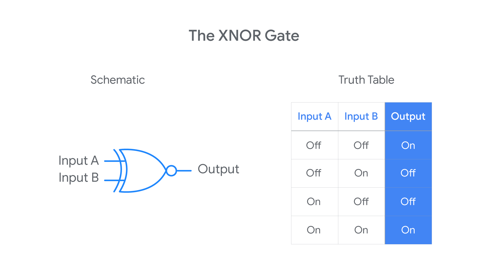

---------------------------------------------------------

## Binary Conversion

Decimal values, binary values, and characters are all used to communicate information. Computers receive and communicate information with binary values, so the binary system shapes the rules and conventions of how computers interact with one another.

### Use a table to convert between decimal and binary

By convention, decimal numbers are represented with 8 bits (1 byte) in binary. Each bit is either a 0 or a 1, so 28 = 256 decimal numbers can be represented with 1 byte. Additionally, each bit represents a specific decimal value based on its order in the byte. The 1st (leftmost) bit is 128, and each bit after that is half the value of the previous one. 

### Convert from binary to decimal values

To use the table to convert from binary to decimal values, enter the byte you want to convert into the “Off or on” row. For example, to convert the byte 10011101 to a decimal value, fill the “Off or on” row with the values of each bit in the byte, like this: 

|              | 1st bit | 2nd bit | 3rd bit | 4th bit | 5th bit | 6th bit | 7th bit | 8th bit |
|--------------|---------|---------|---------|---------|---------|---------|---------|---------|
|Decimal Value | 128     | 64      |  32     |  16     |   8     |    4    |    2    |   1     |
|Off or On     |   1     |   0     |   0     |   1     |   1     |    1    |    0    |   1     |

In this example, 128 + 16 + 8 + 4 + 1 = 157. Therefore, the decimal value represented by the binary number 10011101 is 157.

### Convert from decimal to binary values

To use this table to convert from a decimal value to a binary value, put 0s and 1s in the “Off or on” row of the table so that the sum of the decimal values of any columns that contain a 1 in the “Off or on” row  add up to the decimal value. For example, to convert the decimal value 87 to binary, you’d fill out the table like this: 

|              | 1st bit | 2nd bit | 3rd bit | 4th bit | 5th bit | 6th bit | 7th bit | 8th bit |
|--------------|---------|---------|---------|---------|---------|---------|---------|---------|
|Decimal Value | 128     | 64      |  32     |  16     |   8     |    4    |    2    |   1     |
|Off or On     |   0     |   1     |   0     |   1     |   0     |    1    |    1    |   1     |

The sum of 64 + 16 + 4 + 2 + 1 is 87, so the binary value that represents 87 is 01010111.

### Character encoding: From binary values to characters

As you learned earlier in this lesson, character encoding assigns binary values to characters so that humans can read them. The American Standard Code for Information Interchange (ASCII) was the first character encoding standard used. It uses one byte to represent each character in the English alphabet, digits, and punctuation. Each byte maps to a specific character, so ASCII can only represent 256 characters. The following table displays the ASCII table for the first 5 lowercase letters in the English alphabet: 

| Binary Value   | Decimal Value | Character | 
|----------------|---------------|-----------|
|  01100001      | 97            | a         |  
|  01100010      | 98            | b         |  
|  01100011      | 99            | c         |  
|  01100100      | 100           | d         |  
|  01100101      | 101           | e         |  

UTF-8 is a newer standard that uses the same ASCII character encodings but allows characters to be represented with more than one byte. This allows many more characters–and even emojis–to be represented with binary. 

## Computer Architecture Layer

* Abstraction: To take a relatively complex system and simplify it for our use.

### Four Layer of Computer

Hardware   <-->  Operating System <--> Software  <-->  User

* Hardware Layer: Made up of the physical components of a computer.
* Operating System: Allows hardware to communicate with the System.
* Software Layer: How we as humans interact with out computer.
* User: Interacts with the computer.

### Summary

* Abstraction: To take a relatively complex system and simplify it for our use

* Algorithm: A series of steps that solves specific problems

* ASCII: The oldest character encoding standard used is ASCII. It represents the English alphabet, digits, and punctuation marks

Binary system: The communication that a computer uses is referred to as binary system, also known as base-2 numeral system

Byte: A group of 8 bits

Character encoding: Is used to assign our binary values to characters so that we as humans can read them

Computer: A device that stores and processes data by performing calculations

Cryptography: The overarching discipline that covers the practice of coding and hiding messages from third parties

Decimal form- base 10 system: In the decimal system, there are 10 possible numbers you can use ranging from zero to nine

Digital divide: The growing skills gap between people with and without digital literacy skills

Information technology: The use of digital technology, like computers and the internet, to store and process data into useful information

Linux OS: Linux is one of the largest open source operating systems used heavily in business infrastructure and in the consumer space

Logic gates: Allow transistors to do more complex tasks, like decide where to send electrical signals depending on logical conditions

Open source: This means the developers will let other developers share, modify, and distribute their software for free

PDA (Personal Digital Assistant): Allows computing to go mobile

Punch cards: A sequence of cards with holes in them to automatically perform calculations instead of manually entering them by hand

RGB model: RGB or red, green, and blue model is the basic model of representing colors

UTF-8: The most prevalent encoding standard used today

## Module 2: Hardware

## The Modern Computer

* Ports: Connection points that we connect devices to that extend the functionality of out computer.

* CPU (Central Processing Unit): THe brain of our computer, it does all calculation and data processing.

* Hard drive: Holds all of our data, which includes all of our music, pictures, applications.

* Motherboard: The body or circulatory system of the computer that connects all the pieces together.

* Programs: Instructions that tells the computer what to do.

* External Data bus(EDB): A row of wires that interconnect the parts of our computer.

* Memory Controller Chip: A memory controller chip is a digital circuit that manages the flow of data to and from a computer's main memory (RAM)

* It acts as an intermediary between the CPU and memory, handling read and write operations, refreshing memory, and ensuring data integrity. Older systems often had the memory controller on a separate northbridge chip, but modern systems integrate it directly into the CPU (Integrated Memory Controller or IMC)

* Cache memory is a type of high-speed memory that stores frequently accessed data and instructions, allowing the CPU to retrieve information much faster than accessing main memory (RAM).
 
    
* A "clock wire" in a computer's CPU refers to a wire that carries a clock signal, a periodic pulse that synchronizes the actions of different components within the CPU. This signal dictates when components should update their state, ensuring they operate in unison and that data is processed correctly. Without this clock signal, the CPU's components would not be able to coordinate and would not be able to function.

* Clock speed: The maximum number of clock cycles that it can handle in a cerain period of time.

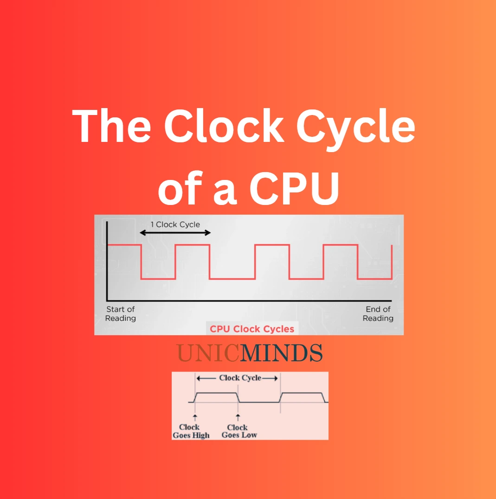

* For examples: A 3.40 gigahertz is 3.4 billion cycles per second.

* CPU cache: CPUs use a system of cache storage to help them quickly access data. A CPU cache is normally stored inside each core of the CPU. Older computers might store CPU cache in a transistor chip that is attached to the motherboard, along with a high-speed bus connecting the chip to the CPU. 

#### CPU levels of cache

There are three levels of CPU cache memory:

* Level 3 cache: L3 cache is the largest and slowest of CPU cache. However, it is often twice as fast as RAM. L3 is the first CPU cache location to store data after it is transferred from RAM. L3 cache is often shared by all of the cores in a single CPU. 

* Level 2 cache: L2 cache holds less data than L3 cache, but it has faster access speeds. L2 holds a copy of the most recently accessed data that is not currently in use by the CPU. Each CPU core normally has its own L2 cache.

* Level 1 cache: L1 cache is the fastest and smallest of the three CPU cache levels. L1 holds the data currently in use by the CPU. Each CPU core usually has its own L1 cache.

#### Overclocking a cpu

* Overclocking a CPU sets it to run at a higher CPU clock frequency rate than the manufacturer’s original specifications. For example, if a processor is labeled as having a 3.2 GHz base frequency rate, it may be possible to overclock the CPU to run at 3.5 GHz. Achieving a higher CPU clock frequency rate means the CPU can process a higher volume of instructions per nanosecond, resulting in faster performance. A computer user might want to overclock their CPU to improve sluggish speeds when performing processor-intensive tasks, like video editing or gaming. 

Overclocking a CPU’s frequency involves three variables:

* The base CPU clock frequency, often measured in GHz.
* The core frequency, which is calculated by multiplying the base frequency by the CPU core multipliers. 
* The core voltage, which needs to be increased in small increments to meet the increasing power demand of the CPU during the overclocking process.

#### Warnings on overclocking

* Overclocking the CPU can damage the computer if not configured properly. Operating a CPU at a higher speed can overheat the CPU and surrounding hardware, which can cause the computer system to fail. Additionally, overclocking the CPU can shorten the overall lifespan of the computer and void the computer’s warranty. It is better to avoid overclocking the CPU and instead purchase the appropriate CPU speed necessary to meet computing demands.  

#### How to overclock a CPU safely

As an IT Support professional, you may be asked to overclock a CPU. There are steps you should follow to do this as safely as possible. Always make sure that the requestor understands the risks of overclocking before agreeing to perform this procedure. 

1. Check if overclocking is supported: First, make sure the CPU is a model that is unlocked for overclocking. Not all CPUs can support overclocking, including most laptop CPUs. Check the CPU manufacturer’s documentation to determine if overclocking is possible for the CPU model. Both Intel and AMD provide overclocking guides and tools for supported CPU models (see below for links to these guides). Additionally, check the documentation for the computer’s motherboard model to ensure that it can support an overclocked CPU.

2. Clean the inside of the computer: Turn off and unplug the computer. While wearing an anti-static wristband, open the computer and use compressed air to remove any dust build-up that has accumulated. It is especially important to remove any dust from around the CPU, fans, and intake vents.

3. Ensure an appropriate CPU cooler is installed (critical): If the computer has a stock CPU cooler, it is most likely insufficient for cooling an overclocked CPU. Replace the stock CPU cooler with an advanced cooling system, like a liquid cooling system.

4. Follow the manufacturer’s instructions for overclocking the CPU: Using the detailed instructions from the manufacturer (see below for links to Intel and AMD’s guides): 

    * Use benchmarking software to establish a baseline for the normal performance of the computer.
    * Set each CPU core multiplier to the value of the lowest multiplier using either the manufacturer’s overclocking software (recommended) or the BIOS. Then reboot the computer. 
    * Increase each CPU core multiplier by 1 to increase the CPU frequency. 
    * Test each increase for stability using the testing utility provided by the manufacturer. 
        * Fix any problems flagged by the testing tools, especially temperature alerts. If the system becomes too unstable, roll back to the last frequency that produced a stable performance and stop overclocking the CPU.
        * If the voltage appears to become insufficient to support the new frequency, increase the voltage by 0.05V. Do not increase the voltage above 1.4V without specialized cooling hardware.
        * If the computer freezes or crashes, it has either become completely unstable or the CPU is not getting enough voltage to support the overclocked frequency. Use the BIOS to return to the last stable frequency or increase the voltage in 0.01V increments until stable.

    * If stable, reboot the computer before attempting the next increase. 

    * The POST (Power On Self Test) figures out what hardware is on the computer and makes sure it is running properly before the BIOS initializes the hardware or loads up essential drivers.

    * The full form of CMOS in computers is Complementary Metal-Oxide-Semiconductor. It's a type of technology used to build integrated circuits, including the memory chip on your computer's motherboard that stores the BIOS settings.
 

## Components

#### IT Supports Hardware Jobs

* Replacing failed hard disk.
* Upgrading RAM modules.
* Installing Video cards.

#### Examples of Modular CPU manufactures

* Intel
* AMD 
* Qualcomm
* Mediatek

#### Examples of CPU

* Intel Corei7
* AMD Athlon
* Snapdragon 810
* Apple A8
------------------

* When you select your CPU, you'll need to make sure that it is compatible with yout motherboard - the circuit board that connects all your components together.

* There are mainly two major types of CPU sockets
    * Land Grid Array(LGA)
    * Pin Grid Array(PGA)

* An LGA sockets have pins coming out of the motherboard.
* A PGA sockets have pins coming out of processors itself.

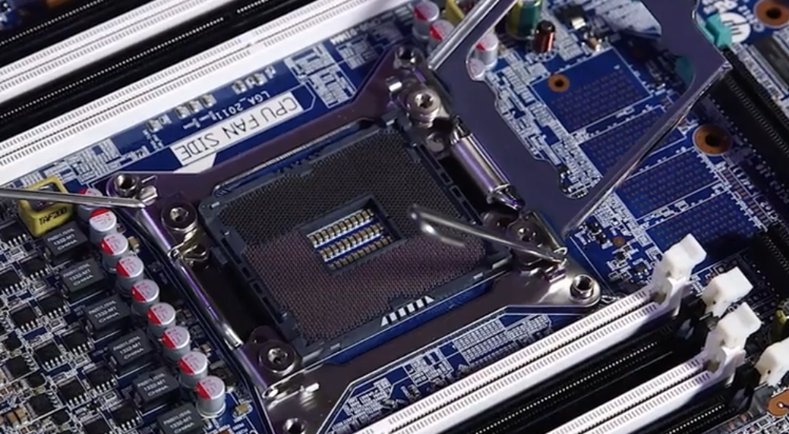

Image of LGA socket.

--------------

* There are lots of types of RAM, and the one that is commonly found in our computers is **DRAM** or dynamic random access memory.

* There are also different types of memory sticks that DRAM chips can be put on. The more modern DIMM sticks, which usually stands for Dual Inline Memory Module, have different sizes of pin on them.

* SDRAM stands for Synchronous Dynamic Random Access Memmory. It's a type of computer memory that operates in sync with the system's clock, enabling faster data transfer rates compared to older memory technologies. 

* In today's system, we use another type of RAM called  double data rate SDRAM or DDR SDRAM for short.

Iteration of DDR SDRAM

* DDR1
* DDR2
* DDR3
* DDR4
* DDR5

#### Motherboard 

* Northbridge: Interconnect Ram and Video Cards.
* Southbridge: Maintains Input/Output(IO) controllers.

* Peripherals: External devices connected to the computers, like a mouse, keyboard, and monitor.

* Expansion slots: Give us the ability to increase the functionality of our computers.

* Form Factor: Determine the amount we can put in and the amount of space we'll have.

* ATX (Advanced Technology Extended) is a motherboard and power supply configuration specification developed by Intel to improve on previous de facto standards like the AT design. 
* ITX (Information Technology Extended) form factor.Mini-ITX is a 170 mm × 170 mm (6.7 in × 6.7 in) motherboard form factor developed by VIA Technologies in 2001.
    * Mini-ITX
    * Nano-ITX
    * Pico-ITX
    * Mobile ITX

-----------------------------
* 8 bits = 1 byte
* 1024 bytes = 1 kilobyte(KB)
* 1024 kilobytes = 1 megabyte(MB)
* 1024 megabytes = 1 gigabyte(GB)
* 1024 gigabytes = 1 terabyte(TB)
* 1024 terabytes = 1 petabyte(PB)
* 1024 petabytes = 1 Exabyte(EB)
* 1024 exabytes  = 1 Zettabyte(ZB)
* 1024 Zetabytes = 1 Yottabyte(YB)

Decimal Nomenclature of Storage Space
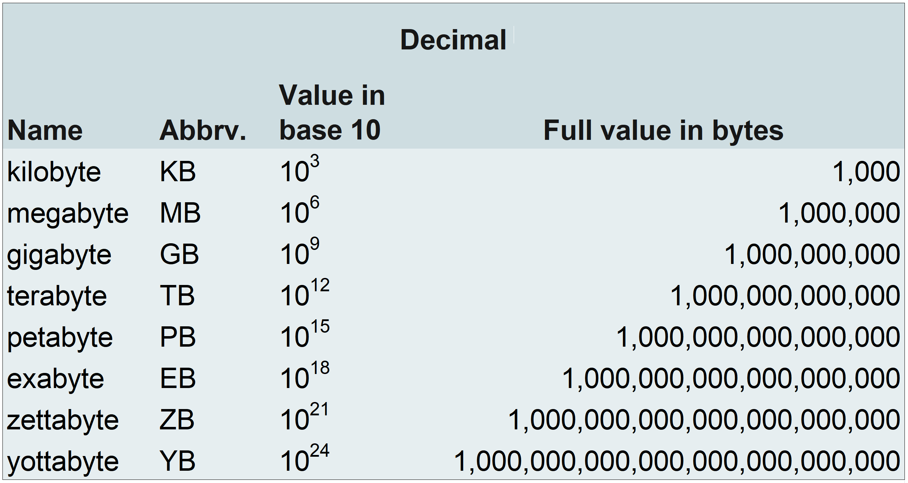

Binary Nomenclature
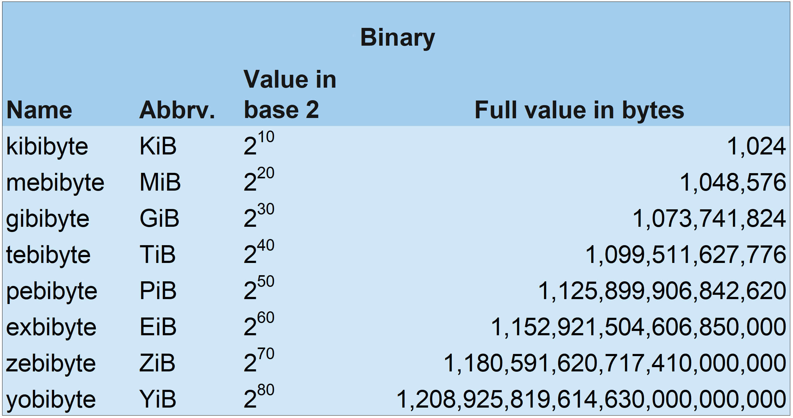

* The prefixes kibi-, mebi-, gibi, -tebi-. pebi-, exbi-, zebi-, and yobi- were created by the IEC organization. They are a blend of the first two letters of the metric prefix fused with the first two letters of the word “binary” (example: megabyte + binary + byte= mebibyte).
--------------------------------

* A Hard Disk Drive(HDD) is a type of hard drive that stores data by magnetically recording binary bits on iron oxide-coated platters, allowing for permanent storage and random access of information in computers.
* RPM(Revolution Per Minute): A hard drive with a higher RPM is faster.
* A solid-state drive (SSD) is a type of solid-state storage device that uses integrated circuits to store data persistently. It is sometimes called semiconductor storage device, solid-state device, or solid-state disk.

* SSDs come in various form factors and interface types, including SATA, PCIe, and NVMe, each offering different levels of performance.
* Note: ATA stands for Advanced Technology Attachment.

* SATA (Serial ATA): Interface that uses one cable for data transfer.
  SATA drives are **Hot Swappable**: You don't have to turn off your machine to plug in a SATA Drive.

* PCI Express (Peripheral Component Interconnect Express), officially abbreviated as PCIe, is a high-speed standard used to connect hardware components inside computers. It is designed to replace older expansion bus standards such as PCI, PCI-X and AGP. Developed and maintained by the PCI-SIG (PCI Special Interest Group), PCIe is commonly used to connect graphics cards, sound cards, Wi-Fi and Ethernet adapters, and storage devices such as solid-state drives and hard disk drives.

* Compared to earlier standards, PCIe supports faster data transfer, uses fewer pins, takes up less space, and allows devices to be added or removed while the computer is running (hot swapping). It also includes better error detection and supports newer features like I/O virtualization for advanced computing needs.

* NVM Express (NVMe) or Non-Volatile Memory Host Controller Interface Specification  (NVMHCIS) is an open, logical-device interface specification for accessing a computer's non-volatile storage media usually attached via the PCI Express bus. The initial NVM stands for non-volatile memory, which is often NAND flash memory that comes in several physical form factors, including solid-state drives (SSDs), PCIe add-in cards, and M.2 cards, the successor to mSATA cards. NVM Express, as a logical-device interface, has been designed to capitalize on the low latency and internal parallelism of solid-state storage devices.

------------------------------

* SATA (Serial AT Attachment) is a computer bus interface that connects host bus adapters to mass storage devices such as hard disk drives, optical drives, and solid-state drives. 
#### Power Supply

* As a general rule, be sure to use proper voltage for your electronics.

* Wattage: The amounts of volts and amps that a device needs.
* You can power most basic desktops with a 500W power supply.

* As you learned in a previous video, computer systems require a direct current (DC) of electricity to operate. However, power companies deliver electricity in alternating currents (AC). AC power can damage the internal components of a computer. To solve this problem, computer power supplies are used to convert the AC from the wall socket to DC. Power supplies also reduce the voltage delivered to the computer’s internal components.

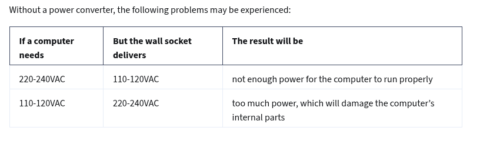

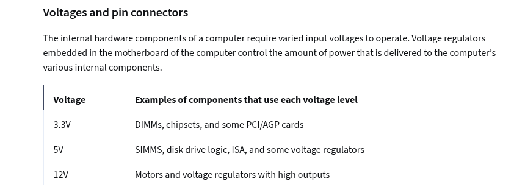

-----------------------

#### Mobile Devices

* System on a Chip(SoC): Packs of CPU, RAM , and Sometimes event the storage onto a single chip.
* BYOD: Bring Your Own Device.

* Charge Cycle: One full Charge and discharge of a battery.

#### Connectors

* USB stands for Universal Serial Bus.

* Iteration of USB
    * USB 2.0 -  Transfer speed of 480 Mb/s (60 MB/s)
    * USB 3.0 - Transfer speed of 5 Gb/s    (625 MB/s)
    * USB 3.1 - Transfer speed of 10 Gb/s

* MB is megabyte or unit of data storage, while Mb/s is a megabit per second, which is the unit of data transfer.
* Inductive charging (also known as wireless charging or cordless charging) is a type of wireless power transfer. It uses electromagnetic induction to provide electricity to portable devices. Inductive charging is also used in vehicles, power tools, electric toothbrushes, and medical devices. The portable equipment can be placed near a charging station or inductive pad without needing to be precisely aligned or make electrical contact with a dock or plug.

* Remember 1 byte is 8 bit, to transfer a file of 1 MB in a second, you need a connection speed of 8 Mb/s.  

* USB Connectors: USB connectors transfer data and power to devices connected to a computer. USB connectors are the most popular connectors for all types of peripherals.

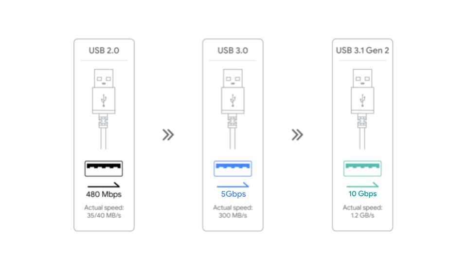

* There are three generations of USB type A connectors in use today: USB 2.0, 3.0, and 3.1. Here are the differences between the three generations:

    * USB 2.0: Black port on the computer, 480 Mbps transfer speed
    * USB 3.0: Blue port on computer, 5 Gbps transfer speed
    * USB 3.1: Teal port on the computer, 10 Gbps transfer speed

* USB ports are backwards compatible, meaning a USB port can connect any of the three generations of USB type A connectors. The connected cable will determine the speed of data transfer. Connecting a USB 3 to a USB 2 port will result in 480 megabits (Mbps) per second of speed.

* Micro USB, USB-C, USB4 (Thunderbolt), and Lightning Ports are smaller connectors that carry more power than older USB connectors and have faster data transfer speeds. These connectors are used for devices like smartphones, laptops, and tablets.

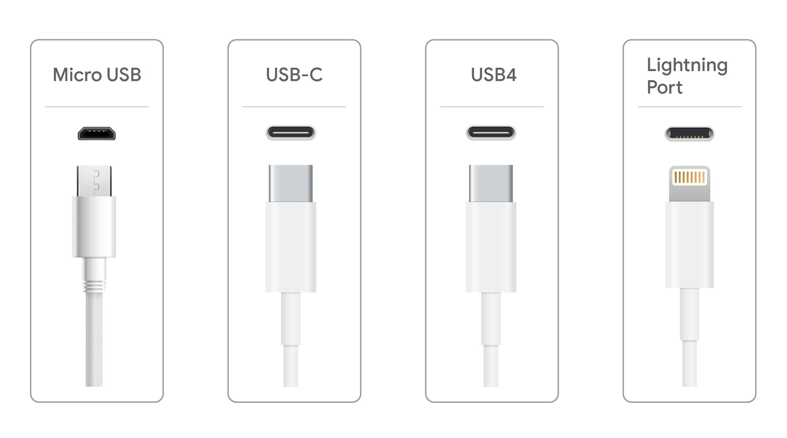

* Micro USB is a small USB port found on many non-Apple cellphones, tablets, and other portable devices. 

* USB-C is the newest reversible connector with either end having the same build. USB-C cables replace traditional USB connectors since they can carry significantly more power and transfer data at 20 Gbps.  

* USB4 uses Thunderbolt 3 protocol and USB-C cables to transfer data at speeds of 40 Gbps and provide power as well. 

* Lightning Port is a connector exclusive to Apple that is similar to USB-C. It is used for charging and connecting devices to computers, external monitors, cameras and other peripherals.

* Different cable connectors are used to share information between devices and connect to the internet. IT professionals maintain network systems that use different types of communication connectors. 

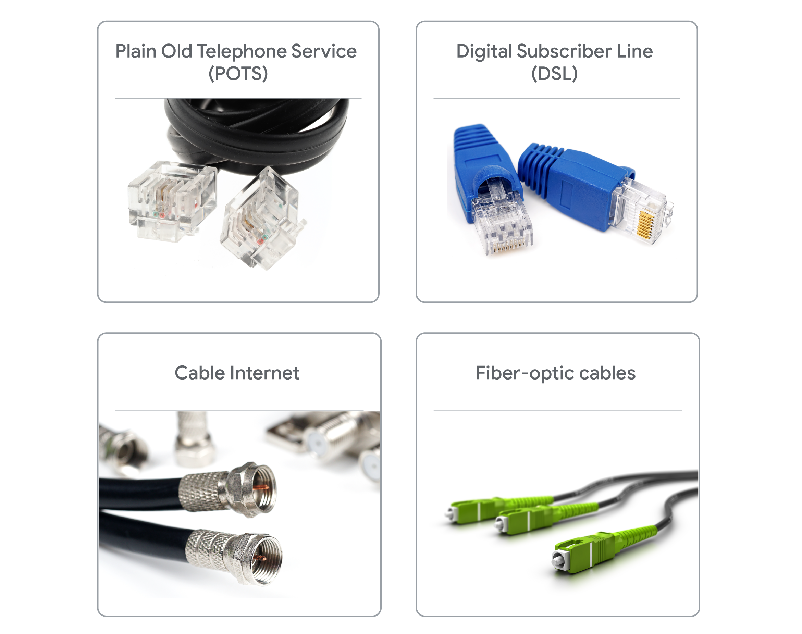

* Plain Old Telephone Service (POTS) refers to cables transmitting voice through twisted copper pair wires. Landline telephones, dial-up internet, and alarm systems use POTS. The RJ-11 (Register Jack 11) connector is used for POTS.

* Digital Subscriber Line (DSL) provides access to high-speed networks or the internet through telephone lines and a modem. The RJ-45 connects a computer to network elements and is mostly used with ethernet cables. 

* Cable Internet uses a cable TV infrastructure and a modem to provide high-speed internet access to users. An F type connector is commonly used with cable modems. 

* Fiber-optic cables contain strands of glass fibers inside an insulated casing that send data long-distance and allow for higher-bandwidth communication. The major internet providers use fiber-optic cables for high-speed internet service. 

* Device Connectors: IT professionals will encounter legacy devices that still use older connectors such as DB89 and Molex.

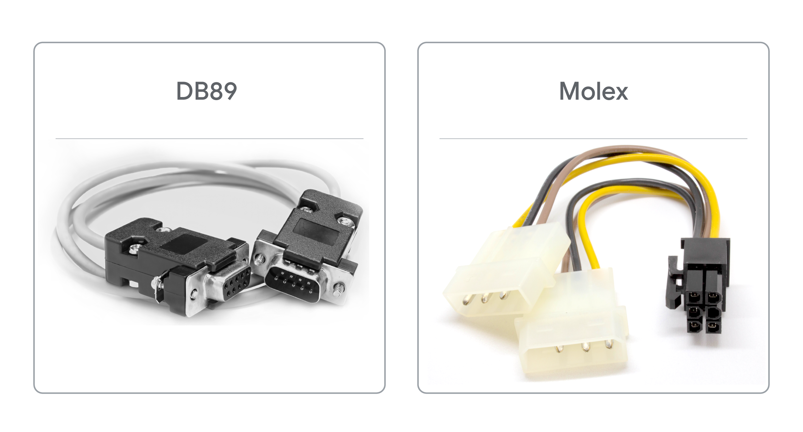

* DB89 connectors are used for older peripherals like keyboards, mice, and joysticks. An IT professional may still encounter a DB89 connector for external tools a computer uses and should recognize the cable to connect to the appropriate port.

* Molex connectors provide power to drives or devices inside the computer. Molex connectors are used for connecting a hard drive, disc drive (CD-ROM, DVD, Blu-ray), or a video card. 

* Punch Down Blocks: A punch down block is a terminal strip used to connect telephone or data lines. Punch down blocks are a quick and easy way to connect wiring. IT professionals use punch down blocks to change a wire or make a new connection for a telephone system or Local Area Network (LAN).

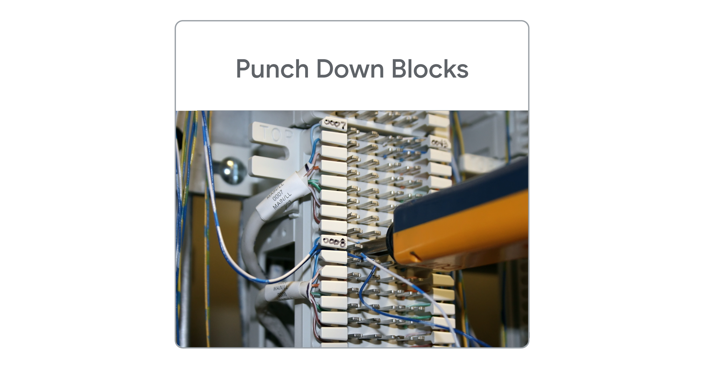

#### BIOS (Basics Input Output Services)

* Software that helps initialize the hardware and gets out operating system up and running.

* The BIOS is firmware that initializes hardware (like the CPU, RAM, and storage) when you turn on your computer and provides the basic instructions for the operating system to load. It acts like a bridge between the hardware and software.

##### Why ROM?

* The BIOS is stored on a ROM chip because ROM is non-volatile, meaning it retains data even when the computer is powered off. This ensures the BIOS is always available to start the system.
* Traditionally, ROM was truly "read-only," but modern BIOS chips use EEPROM(Electrically Erasable Programmable ROM) or flash memory, which allow updates (like flashing a new BIOS version) while still being non-volatile.

##### Where is the ROM Chip?

* The ROM chip is physically located on the motherboard, often a small chip labeled with the BIOS manufacturer (e.g., AMI, Award, or Phoenix). It’s usually near the edge of the motherboard or close to other critical components.

#### How Does the BIOS Work?

1. Power-On Self-Test (POST):
    * The BIOS runs a quick check to ensure hardware (CPU, RAM, keyboard, etc.) is working. If something’s wrong (e.g., no RAM), it might beep or show an error.
    * This step uses the low DC voltages (e.g., 1.1V for CPU, 3.3V for motherboard circuits) provided by the power supply or laptop adapter, as you asked about earlier.

2. Initialize Hardware:
    * The BIOS sets up the CPU, RAM, and other components with basic instructions, like telling the CPU how fast to run or the RAM how to communicate.
    * It ensures all components get the correct low voltages (e.g., 1.2V for DDR4 RAM) to operate safely, avoiding the high-voltage AC damage you asked about with laptops.

3. Find the Operating System:
    * The BIOS looks for a bootable device (like your SSD or HDD) and hands control to the operating system’s bootloader.
    * It uses a boot order (set in the BIOS menu) to decide whether to boot from a hard drive, USB, or network.

4. Provide Basic Communication:
    * The BIOS offers a basic interface for the operating system to talk to hardware, like reading from a keyboard or writing to a screen, until the OS loads its own drivers.

##### Why Does the BIOS Matter?

The BIOS is critical because it’s the first step in making your computer work. Without it:
* The CPU wouldn’t know how to start.
* The RAM wouldn’t initialize.
* The operating system couldn’t load.It’s like a conductor starting an orchestra—it gets all the hardware playing together.

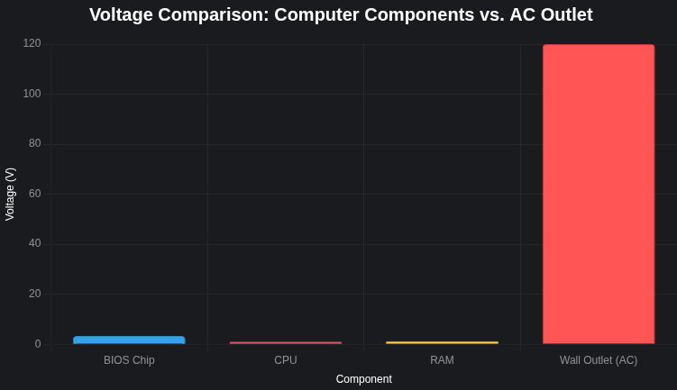

#### UEFI

* UEFI is the modern replacement for BIOS. Like BIOS, it’s firmware stored on a ROM chip (usually EEPROM or flash memory) on the motherboard. Its job is to initialize hardware and load the operating system when you turn on your computer, but it’s more advanced, flexible, and powerful than traditional BIOS.
* Think of BIOS as a basic flip phone and UEFI as a smartphone—both get the job done, but UEFI does it faster, with more features, and a better interface.

#### Why Did UEFI Replace BIOS?
BIOS was designed in the 1970s for simple PCs, but modern computers need more:

* Larger Storage: BIOS couldn’t handle drives over 2TB, while UEFI supports massive drives.
* Faster Systems: UEFI’s parallel initialization speeds up booting, critical for modern SSDs and NVMe drives.
* Security: Secure Boot protects against malware, which BIOS couldn’t do.
* Flexibility: UEFI supports complex setups like multi-OS environments or network booting.

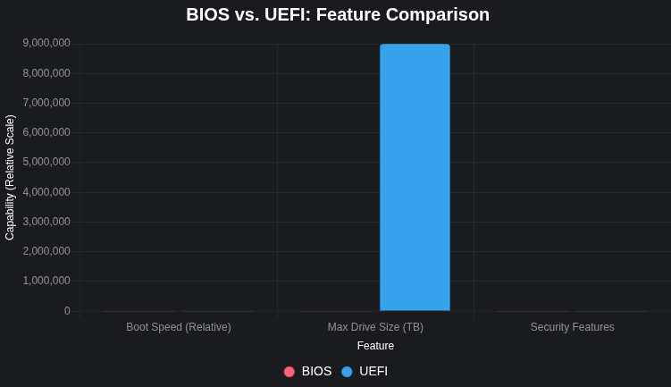

Notes on the Chart:

* Boot Speed: UEFI is ~3x faster (arbitrary scale for simplicity).
* Max Drive Size: BIOS supports up to 2TB; UEFI supports ~9 million TB (9 zettabytes).
* Security: UEFI’s Secure Boot and other features score higher (5 vs. 1 on a relative scale).

* Disk Image: Copy of an operating system.
* Reimaging: Wiping and installing an operating system.

* Standoffs are used to raise and attach your motherboard to the case.

* Molex: A molex is a component connector.

* Make sure to connect the SATA power plug to the SSD.

#### Mobile Device Repair

* Factory reset: Removes all data, apps and customizations from the device.

Steps to take care while repairing mobile devices

* Protect against static discharge.
* Use the right tool.
* Keep parts organized and labeled. Taking pictures along the way can help a lot, too
* Follow Vendor documentation
* Test the device to make sure it works.

#### Mobile Display Types

* The top two technologies used in mobile system displays are 
    1. Liquid Crystal Display (LCD) 
    2. Light Emitting Diodes (LED)

##### Liquid Crystal Display (LCD) 

* LCDs use liquid crystal technology. Liquid crystals have the properties of both a liquid and a solid. The crystals can be aligned in a variety of patterns and manipulated with electricity.
* How the liquid crystals are arranged and manipulated inside display panels affects refresh rates, image quality, and display performance.
* LCDs require backlighting, often provided by LEDs. Displays that need backlighting are also called non-emissive or passive displays.
* The backlighting unit (BLU) requires extra space, which makes LCD panels thicker and less flexible than other displays. Polarizers on either side of the liquid crystal layer control the path of the backlight to ensure the light is aimed toward the user.

* The following are common LCD display types used for mobile devices: 

    1. In-Plane Switching (IPS) 
    1. Twisted Nematic (TN)
    1. VA-Vertical Alignment

[Mobile Display Type](https://www.coursera.org/learn/technical-support-fundamentals/supplement/CEavl/mobile-display-types)

##### Organic Light Emitting Diodes (OLED)

* OLEDs are diodes that emit light using organic (carbon-based) materials when electricity is passed through the diodes. Displays that are able to convert electricity into light are called emissive or active displays. 

* How it works: The basic structure of an OLED display consists of an emissive layer placed between a cathode (which injects electrons) and an anode (which removes electrons). Electricity enters through the cathode layer, passes into the emissive layer and conductive layer to create light, then out through the anode layer.

##### Active Matrix Organic Light Emitting Diode (AMOLED)
* Active Matrix Organic Light Emitting Diode (AMOLED) and Super AMOLED are recent technologies used in smartphone displays. 

* How it works: AMOLED displays are a type of OLED panel that uses active matrix technology. Active-matrix displays have active capacitors arranged in a matrix with thin film transistors (TFTs). This technology enables the control of each individual pixel for rapid state changes, including changing brightness and color. AMOLEDs have touchscreen functions integrated into the screen.

##### Inorganic mini-LEDs (mLEDs) 
* How it works: Mini-LED displays work the same way that OLED displays work, but the individual LED size is much smaller at approximately 50-60 micrometers.

##### Inorganic micro-LEDs (μLEDs)
* How it works: Micro-LED displays work the same way that OLED displays work, but the individual LED size is extremely small at 15 micrometers.

[Glossary terms from course 1, module 2](https://www.coursera.org/learn/technical-support-fundamentals/supplement/mZ5qd/glossary-terms-from-course-1-module-2)

## Module 3: Operating System

* Operating System: The whole package that manages out computer's resources and lets us interact with it.
* Operating Systemm is made of minly two parts:
    1. User Space
    2. Kernel Space

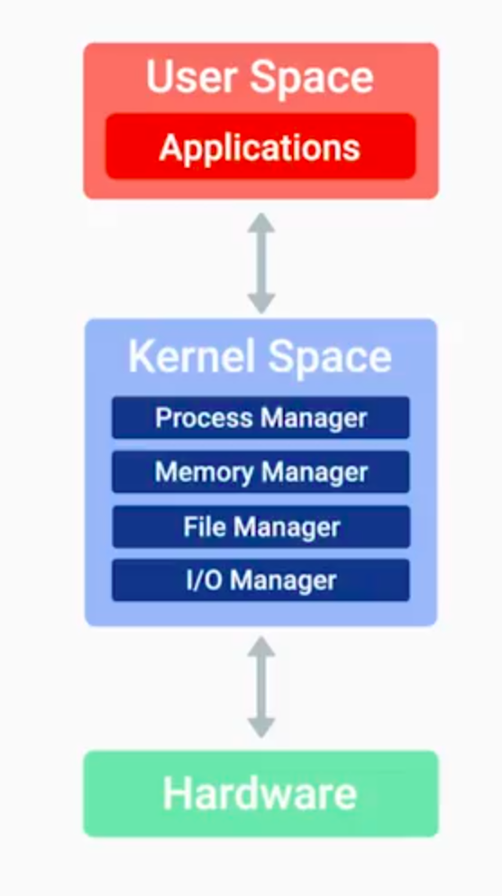

* List of Major Operating System
    * Windows 
    * Mac
    * Linux
    * Chrome OS

* Our kernal optimizes **memory usage** and makes sure that out applications have enough memory to run. 

* I/O management: Anything that can give us input, or that we can use for output of data.

##### Basics Function of Kernel

* File management
* Process management
* Memory management
* I/O management

##### File management

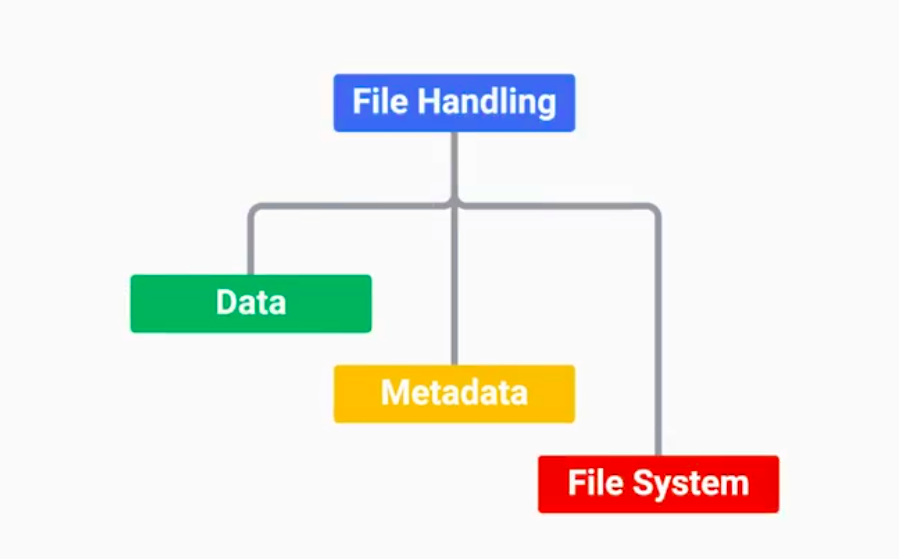

* NTFS, which stands for New Technology File System, is a file system developed by Microsoft and is the default file system for modern Windows operating systems. It offers several advantages over older file systems like FAT, including better performance, increased reliability, and support for larger storage devices and files. 

* Advantages of NTFE
    * Encryption
    * Faster access speeds
    * Security

* We write data to our hard drive in the form of data blocks.

* Block Storage improves faster handling of data because data isn't stored as one long piece and can be accessed quicker.

* Metadata store the information about File.

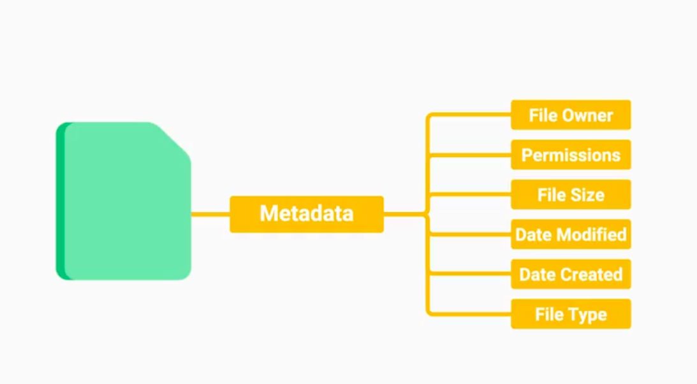

* File extention: The appended part of file name that tells us what type of file it is in certain operating systems.

##### Process Management 

* Process: A program that's executing, like our internet browser or text editor.
* Program: An application that can run, like chrome.

* Time Slice: A very short interval of time that gets allocated to a process for CPU execution.

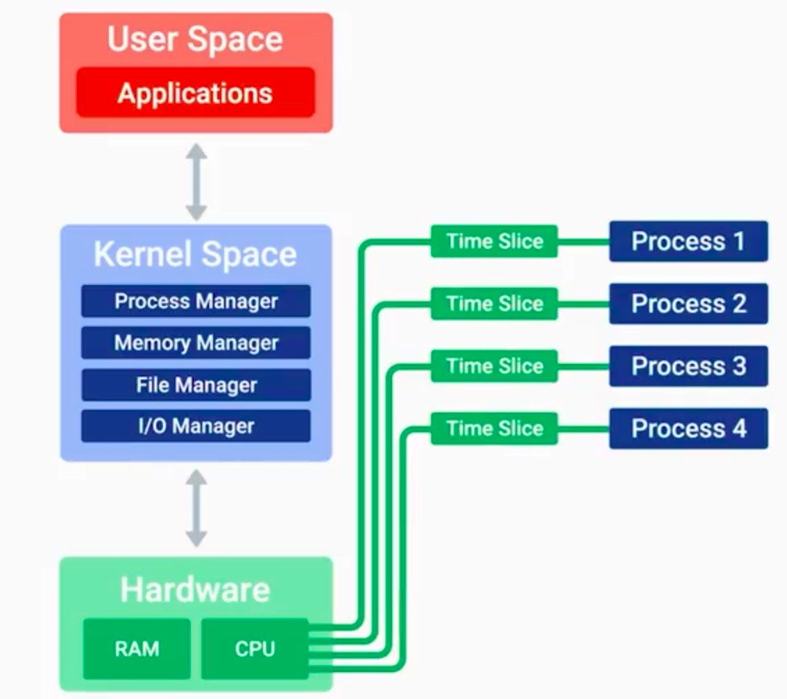

* Kernel: Created processes, efficiently schedules them, and manages how the processes are terminated.

* Virtual memory is a memory management technique that provides the illusion of a larger memory space than the actual physical RAM available. It allows a computer to run programs larger than the physical memory by using a portion of the hard drive as an extension of RAM. This technique is crucial for multitasking and running large applications efficiently. 

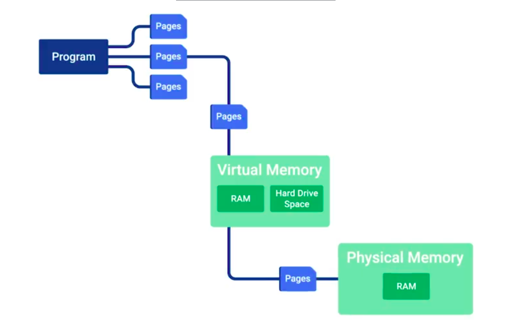

